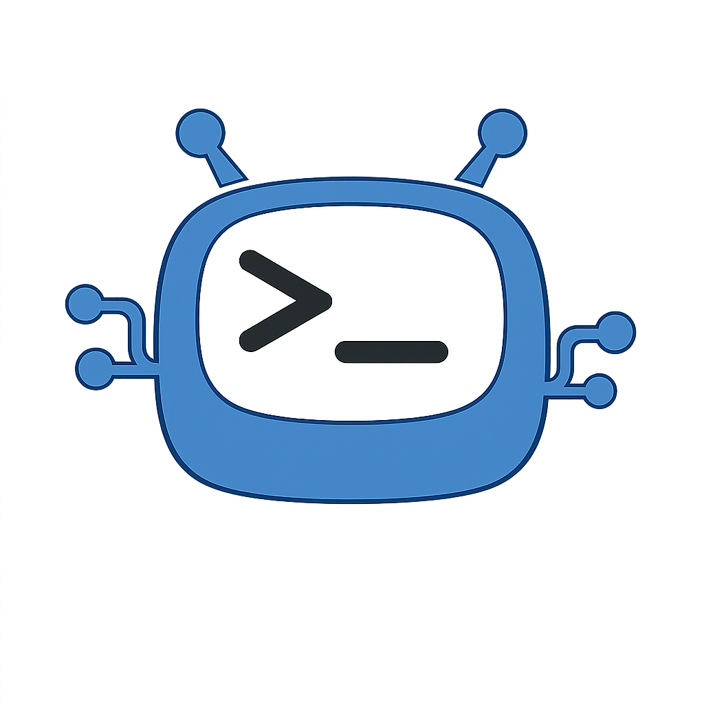

<p align="center"></p>

# Codex-Router

面向 Windows 单用户的 Codex 多模型、多 API 本地路由器。核心路由使用 Sub2API，配置界面使用 Rust + egui；PostgreSQL、Redis 和 Sub2API 已包含在便携包内。

唯一官方下载与更新地址：<https://github.com/HernanJiang/Codex-Router>。请勿从网盘、群文件、镜像站或第三方软件站下载。

## 使用方法

1. 解压完整的 `Codex-Router-Portable.zip`，不要只把 EXE 单独移出文件夹。
2. 双击 `Codex-Router-Configurator.exe`。
3. 按向导填写第一个模型的名称、Base URL、API Key，并选择多模态、网络代理和 CC Switch 隔离同步。
4. 完整阅读内置的《Codex-Router 使用与分发承诺》（其中包含 Sub2API 专项合规条款），滚动到底并由你本人点击同意，然后点击“一键完成配置”。程序不会替你静默接受该承诺。
5. 程序会自动初始化本地环境、创建 Sub2API 模型渠道、写入 Codex 配置并启动路由。
6. 以后增加模型或修改代理时，直接在控制台内编辑并点击“保存并应用全部配置”。

无需安装 Python、Node.js、Rust、PostgreSQL 或 Redis。首次初始化和首次启动可能需要几十秒；程序只监听 `127.0.0.1`。

## 功能

- 多模型、多 Base URL、多 API Key，以及按优先级自动兜底。
- ChatGPT OAuth 上游渠道；完成首次配置后可在控制台点击登录。
- 模型多模态自动识别，并允许逐模型手动强制开启或关闭。
- HTTP、HTTPS、SOCKS5、SOCKS5H 代理，兼容 Clash、V2Ray、SSR 等本机代理软件。
- 可选 CC Switch 独立 Provider 同步；不勾选时完全不写 CC Switch，勾选时先备份数据库。
- 自适应无滚动向导界面，输入框使用明确的高对比文字与焦点状态。
- 内置“蓝天 / 白”和“咖啡 / 米白”两套雾面杂志主题；默认使用蓝天 / 白，可在顶栏即时切换。
- 相同 Logo 用于 EXE、窗口、界面和系统托盘。

## 密钥安全

- 第三方 API Key、代理密码及本地路由密钥保存在当前 Windows 用户的凭据管理器中。
- `codex-router-config.json` 和 `config/sub2api-channels.json` 只保存凭据名称，不保存 Key。
- Codex 访问本机路由所需的随机本地 Key 会自动生成并写入当前用户环境变量 `CODEX_ROUTER_API_KEY`。它只对 `127.0.0.1` 上的本机路由有效，不是第三方供应商 Key。
- 发布包不包含 `data/`、`logs/`、用户配置、数据库、OAuth 状态或开发机路径。

若曾把真实 Key 写入聊天、截图或旧配置文件，请到供应商后台撤销旧 Key，再通过本程序录入新 Key。

## 目录要求

`Codex-Router-Configurator.exe` 必须与以下目录位于同一根目录：

```text
Codex-Router/
  Codex-Router-Configurator.exe
  app/sub2api.exe
  postgres/pgsql/...
  redis/Redis-8.10.0-Windows-x64-msys2/...
  scripts/...
  config/...
```

程序会按 EXE 所在位置自动推导根目录，不依赖盘符、用户名或固定安装路径。

## 开发构建

运行 `codex-router-gui-rust/build-release.bat`。构建需要 Rust MSVC 工具链和 Visual Studio C++ Build Tools；最终用户不需要这些开发工具。

## 使用许可

Codex-Router 原创部分仅授权个人、非商业使用，禁止未经书面许可的商用、收费、转售、镜像、二次分发、重新打包、去除署名或冒充原创。完整条款见 [中文承诺](TERMS.zh-CN.md) 和 [English Terms](TERMS.en.md)。Sub2API 及其他第三方组件继续适用其各自的上游许可证和合规文件，详见 [第三方声明](THIRD_PARTY_NOTICES.md)。
