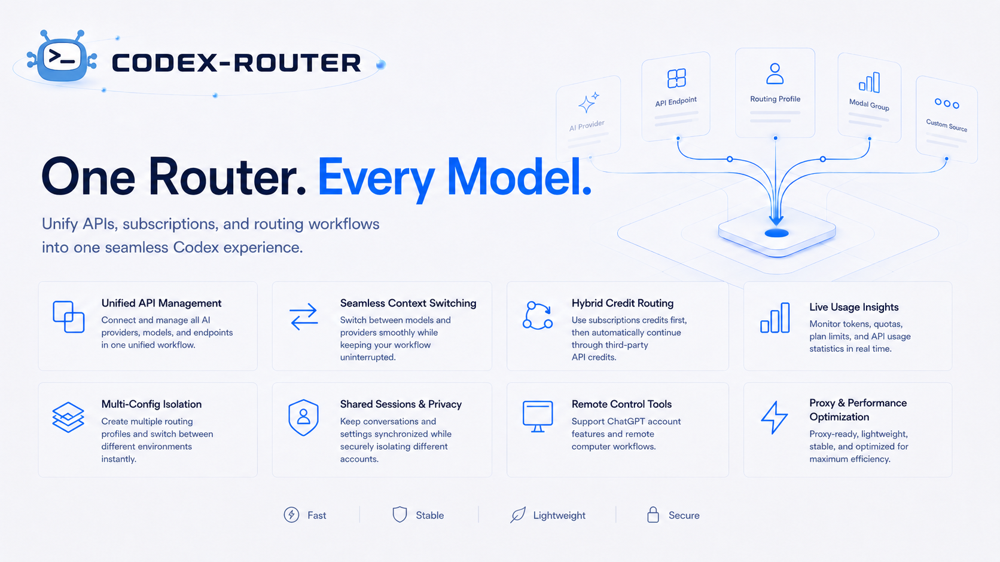
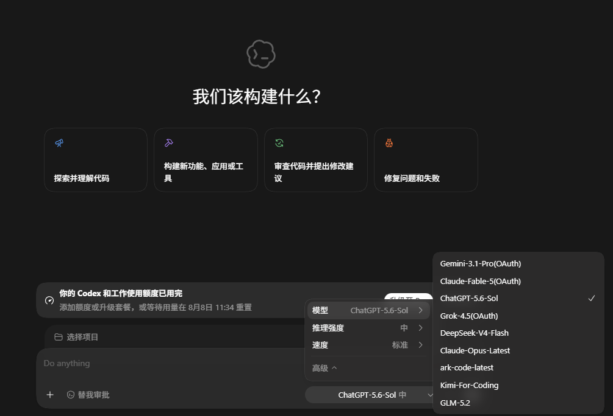

<p align="center">
  
</p>

<h1 align="center">Codex-Router</h1>

<p align="center"><strong>一个入口，接入你的全部 Codex 模型、API 与订阅账号</strong></p>

<p align="center">
  
  
  
  
</p>

<p align="center">
  <a href="#下载与安装">下载</a> ·
  <a href="#核心能力">核心能力</a> ·
  <a href="#实际效果">实际效果</a> ·
  <a href="#密钥安全">安全说明</a>
</p>

Codex-Router 是面向 Windows 单用户的 Codex 本地多模型路由器。它把不同 AI 服务商、订阅账号、API Key 和模型统一接入 Codex，并按你设定的优先级自动切换与兜底。核心路由基于 Sub2API，桌面控制台使用 Rust + egui；PostgreSQL、Redis 和 Sub2API 已全部包含在便携包内。

> 当前版本：**v1.3.10**。解压即用，无需安装 Python、Node.js、Rust、PostgreSQL 或 Redis。

官方发布与更新地址：<https://github.com/HernanJiang/Codex-Router>。允许按许可证分发，但分发页面和副本必须醒目标注作者 `Hernan_Jiang` 及此官方 GitHub 地址；第三方副本不代表官方发布。

## 核心能力

| 能力 | 说明 |
| --- | --- |
| 统一模型入口 | 在一套配置中管理多模型、多 Base URL、多 API Key 与 OAuth 订阅账号。 |
| 智能优先级与自动兜底 | 优先消耗订阅额度，限额或故障时自动切换到同名 API 渠道，恢复后自动回切。 |
| 多配置隔离 | 为不同项目、账号或环境创建独立路由配置，一键切换并自动保留可逆还原点。 |
| 用量与状态监控 | 集中查看账号套餐、额度、模型状态、路由健康度和 API 使用情况。 |
| 代理与网络适配 | 支持 HTTP、HTTPS、SOCKS5、SOCKS5H，并兼容现有 Clash、Mihomo、sing-box、V2Ray 规则。 |
| 本地安全存储 | API Key、代理密码和本地路由密钥写入 Windows 凭据管理器，OAuth 令牌由 Sub2API 管理。 |

## 下载与安装

前往 [GitHub Releases](https://github.com/HernanJiang/Codex-Router/releases/tag/v1.3.10) 下载：

`Codex-Router-Portable-1.3.10-windows-x64-20260806-105323-965.zip`

支持 Windows 10/11 x64，不支持 ARM64。

## 使用方法

1. 解压完整的 `Codex-Router-Portable.zip`，不要只把 EXE 单独移出文件夹。
2. 双击 `Codex-Router.exe`。
3. 按向导填写第一个模型的名称、Base URL、API Key，并选择多模态与网络代理。
4. 完整阅读内置的《Codex-Router 使用与分发承诺》（其中包含 Sub2API 专项合规条款），滚动到底并由你本人点击同意，然后点击“一键完成配置”。程序不会替你静默接受该承诺。
5. 程序会自动初始化本地环境、创建 Sub2API 模型渠道、写入 Codex 配置并启动路由。
6. 以后增加模型或修改代理时，直接在控制台内编辑并点击“保存并应用全部配置”。

无需安装 Python、Node.js、Rust、PostgreSQL 或 Redis。首次初始化和首次启动可能需要几十秒；程序只监听 `127.0.0.1`。

## 功能

- 多模型、多 Base URL、多 API Key，以及按优先级自动兜底。
- OAuth 账号与额度管理支持 Sub2API 当前提供的 OpenAI/ChatGPT、Anthropic/Claude、Google Gemini、Google Antigravity 与 xAI/Grok 登录入口；可查看已登录账号、套餐、状态和可用模型，并将模型加入当前路由配置。
- OAuth 模型列表同时支持平台发现结果和逐账号手动补填；当 Sub2API 的列表滞后时，可打开对应平台官方文档并填写准确模型 ID。一键导入只展示账号真实发现到的模型，手动补填的模型会在实际请求时由平台验证。
- 每套路由配置保存独立的 OAuth 账号选择；只有已导入且在当前配置中启用的 OAuth 模型才会建立同名 API Key 回退链。匹配模型优先使用账号额度，第三方渠道按较低优先级自动兜底；无对应订阅的 API Key 模型保持普通独立渠道。OAuth 令牌始终由 Sub2API 保存，不写入 Router 配置文件。
- OAuth 遇到平台限额时优先采用上游给出的重置时间，在恢复前直接使用同名 API 回退；无法取得重置时间时，每个账号最多每 5 小时执行一次保底探测，探测成功后自动恢复。恢复探测只使用账号实际公布的模型，不会把手动补填但尚未被平台支持的模型误标为可用。
- 图片输入根据模型文档保守判断，并允许逐模型手动强制开启或关闭；DeepSeek、普通 GLM 与常见 Coder 模型默认为纯文本，明确的 Vision/VL 模型才默认开启图片。
- 每个模型可使用文档默认上下文或手动设置窗口；默认在 80% 窗口处自动压缩，为模型输出和工具调用保留更保守的余量。
- 可在模型渠道中指定默认模型；保存并应用后，新建 Codex 窗口和任务会优先使用该模型，旧配置自动回退到第一个可用模型。
- 默认只读发现当前用户的环境变量或 Windows 系统代理，也可显式配置 HTTP、HTTPS、SOCKS5、SOCKS5H；不硬编码开发者的代理端口。国内直连与其他分流沿用用户自己的 Clash、Mihomo、sing-box、V2Ray 等规则及 Windows 绕过列表，Router 不修改系统代理。
- 控制台提供独立的“切换配置分组”页面：可恢复 Codex 官方登录配置、返回最近一次应用前配置，并创建多个使用独立 API 凭据的本地配置；每次切换前自动生成可逆还原点。
- 默认在 Windows 登录后让 Codex-Router 直接进入轻量托盘模式，确保本机转发持续可用；不启动独立守护进程，可在“网络代理”页面关闭此设置。
- 本地 OAuth 快照只保存为 Windows 当前用户可解密的 DPAPI 数据，不把 `auth.json` 明文复制进配置档案。
- Codex 模型目录按公开模型 ID 去重；同一模型可继续由多个后端渠道容错，但右下角只显示一个模型菜单项。GPT-5.6 Sol/Terra 提供 `low` 到 `max` 及 `ultra`，Luna 提供 `low` 到 `max`。
- 自适应无滚动向导界面，输入框使用明确的高对比文字与焦点状态。
- 内置“蓝天 / 白”和“咖啡 / 米白”两套雾面杂志主题；默认使用蓝天 / 白，可在顶栏即时切换。
- 相同 Logo 用于 EXE、窗口、界面和系统托盘。
- 第一次关闭窗口会说明：完全退出将停止连接检测和自动恢复，建议最小化到托盘。托盘轻量模式暂停日志跟随、用量刷新、OAuth 定时维护与界面刷新，只保留每 60 秒一次的原生健康检查和连续失败后的无窗口恢复；托盘右键仍可打开控制台、选择或应用配置、启动或关闭转发、关闭配置窗口和退出软件。偏好独立保存在 `codex-router-ui-preferences.json`，不会触发 Router 重新部署。

## 实际效果

在 Codex 中直接切换通过 Codex-Router 汇总的不同服务商、订阅账号与 API 模型，原有工作流无需改变。

<p align="center">
  
</p>

## 密钥安全

- 第三方 API Key、代理密码及本地路由密钥保存在当前 Windows 用户的凭据管理器中。
- `codex-router-config.json` 和 `config/sub2api-channels.json` 只保存凭据名称，不保存 Key。
- Codex 访问本机路由所需的随机 LocalApiKey 会自动生成，以 Windows Credential Manager 为权威存储，并作为 `experimental_bearer_token` 写入本机 Codex Router 配置。它只对回环地址上的本机路由有效，不是第三方供应商 Key。
- 配置写入后会通知 Windows 刷新环境；已经运行的 Codex 仍需完全退出后重新打开，新进程才会重新加载 Provider 和模型目录。
- 发布包不包含 `data/`、`logs/`、用户配置、数据库、OAuth 状态或开发机路径。
- 正式发布版把 Router 配置、界面偏好、配置分组、恢复快照、OAuth 账号数据库和 Sub2API 持久数据统一保存在 `%LOCALAPPDATA%\Codex-Router\UserData`，不再依赖当前解压目录。Redis、PID、锁和界面缓存属于临时状态，升级时会重新生成。
- 从旧便携版升级时，新版首次启动会在相邻的旧版本目录中选择数据最完整的一份迁移到稳定用户数据目录；迁移完成后可以删除旧解压目录。源码与测试目录仍默认自包含，设置进程环境变量 `CODEX_ROUTER_PORTABLE_STATE=1` 也可显式启用自包含状态，便于隔离测试。

若曾把真实 Key 写入聊天、截图或旧配置文件，请到供应商后台撤销旧 Key，再通过本程序录入新 Key。

## Sub2API 本地管理

Sub2API 默认仅监听 `127.0.0.1:18080`。端口不是协议常量：需要避开本机端口冲突时，可在高级 JSON 中把 `deploy.sub2apiHost` 改为其他本机 HTTP 端口并重启路由；程序会让启动、健康检查、OAuth 与 Codex 共用这个地址，并拒绝远程主机和 HTTPS 管理地址。管理员邮箱为 `admin@admin.com`，密码在首次初始化时随机生成并保存在当前用户的 Windows 凭据管理器中，不写入说明文字或登录页。控制台会先显示说明，再打开完整管理页；登录信息与本机 Router Key 均可通过界面复制，OAuth token 不提供导出。

构建 GitHub Release 时运行 `scripts/Build-PortableRelease.ps1 -OutputRoot <输出目录>`。脚本从 Release EXE、必要运行时和白名单配置重新组装全新便携包，明确排除 `data/`、`logs/`、`backups/`、实际 Router 配置、OAuth 数据库和本机 UI 偏好，并在压缩前扫描用户绝对路径与常见密钥格式。不要直接压缩正在使用的 Codex-Router 目录。

完整验收并提交源码后，运行 `scripts/Publish-GitHubRelease.ps1 -StagePath <解压目录> -ArchivePath <ZIP>`。发布器要求目标仓库保持 Private，上传本机已验收的 ZIP，并通过“检查更新”重新下载该私有资产，验证大小和 SHA-256 一致；GitHub Actions 会对同一资产再次执行清单校验。Private 阶段的最终用户需要安装 GitHub CLI 并登录有仓库访问权的账号；仓库以后公开后，检查更新会自动改用匿名 GitHub API，无需 GitHub CLI。

发布器会从已安装 Visual Studio 的官方 `VC\Redist\MSVC\<version>\x64\Microsoft.VC*.CRT` 目录自动选择最新完整运行库，并把同一组 `VCRUNTIME140.dll`、`VCRUNTIME140_1.dll` 和 `MSVCP140.dll` 分别放在 GUI 根目录与 `postgres/pgsql/bin`。构建机也可通过环境变量 `VC_REDIST_CRT_DIR` 或脚本参数 `-VcRedistCrtDir` 显式指定一个从微软官方 VC Redist 取得的 x64 CRT 目录。脚本会校验 x64 PE、微软 Authenticode 签名、版本一致性与两处文件哈希，并明确拒绝以 `System32` 或 `SysWOW64` 为来源；不要从 Windows 系统目录复制 DLL。最终用户无需预装 Visual Studio 或 VC++ Redistributable。

## 目录要求

支持范围为 Windows 10/11 x64，不支持 ARM64。便携包包含经校验的微软官方 app-local VC++ Runtime，最终用户无需另行安装 Visual Studio 或 VC++ Redistributable。程序运行时会从解压目录读取只读组件，并在当前用户的 `%LOCALAPPDATA%\Codex-Router\UserData` 中创建或更新配置、数据和备份；日志仍可按运行脚本的约定写入运行目录或用户数据目录，因此不要从只读压缩包内直接启动。

`Codex-Router.exe` 必须与以下目录位于同一根目录：

```text
Codex-Router/
  Codex-Router.exe
  app/sub2api.exe
  postgres/pgsql/...
  redis/Redis-8.10.0-Windows-x64-msys2/...
  scripts/...
  config/...
```

程序会按 EXE 所在位置自动推导根目录，不依赖盘符、用户名或固定安装路径。

## 开发构建

运行 `codex-router-gui-rust/build-release.bat`。构建需要 Rust MSVC 工具链和带 x64 VC Redist 文件的 Visual Studio C++ Build Tools；最终用户不需要这些开发工具。

## 使用许可

Codex-Router 原创部分仅授权个人、非商业使用。允许分发原版或修改版，但必须保留作者 `Hernan_Jiang`、许可证、第三方声明，并在分发页面及副本中醒目标注官方 GitHub 发布地址 <https://github.com/HernanJiang/Codex-Router>；修改版还必须明确标注“非官方修改版”和主要改动。禁止未经书面许可的商用、收费、转售、去除署名或冒充官方/原创。完整条款见 [中文承诺](TERMS.zh-CN.md) 和 [English Terms](TERMS.en.md)。Sub2API 及其他第三方组件继续适用其各自的上游许可证和合规文件，详见 [第三方声明](THIRD_PARTY_NOTICES.md)。
