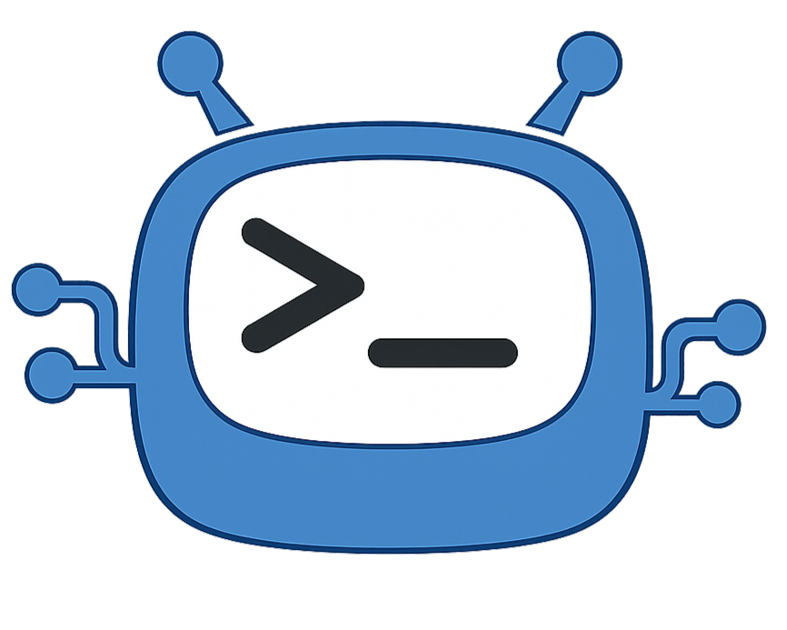
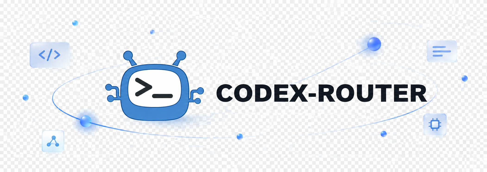
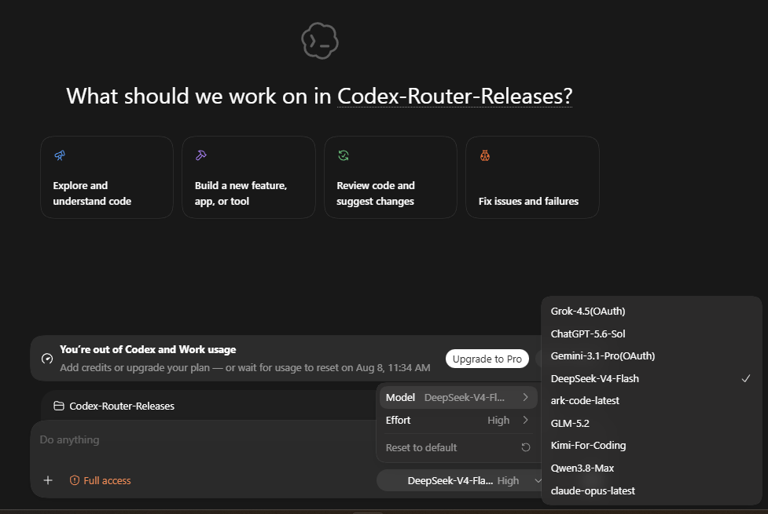
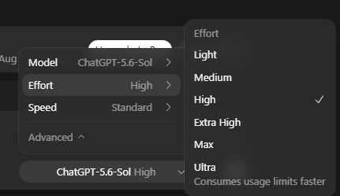
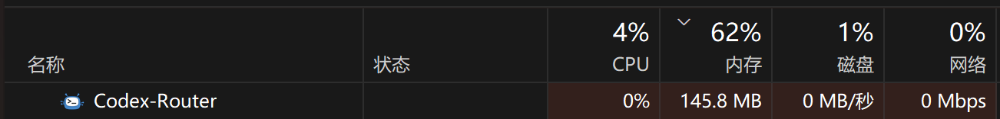
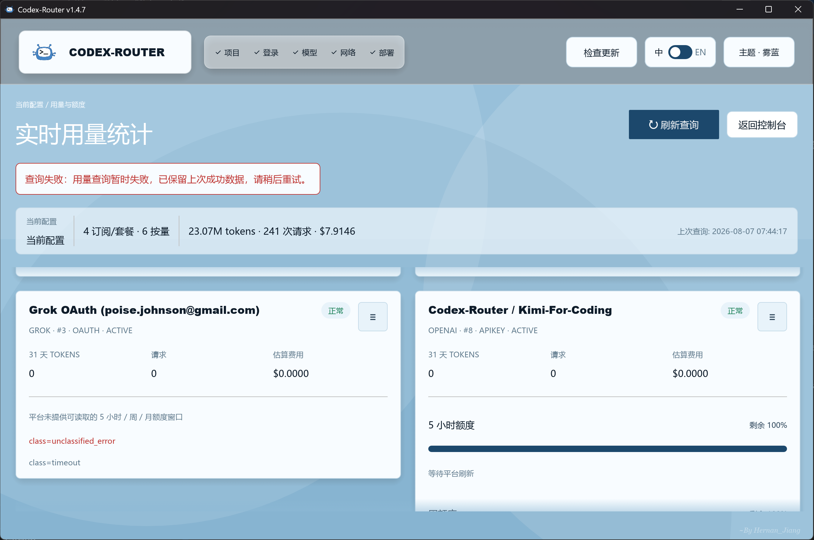

  

<h1 align="center">CodexRouter</h1>

<strong>One router for every model, subscription, and API channel.</strong>

  

  
  
  
  

  <a href="README.zh-CN.md"><strong>中文 README</strong></a>

  <a href="#overview">Overview</a> ·
  <a href="#model-routing">Model routing</a> ·
  <a href="#usage-monitoring">Usage monitoring</a> ·
  <a href="#download-and-first-run">Download</a> ·
  <a href="#security-and-terms">Security</a>

CodexRouter keeps the original Codex workflow while adding a unified model menu for multiple providers, OAuth subscription accounts, and third-party API channels. With automatic continuity enabled, matching OAuth and API channels share one public model and subscription quota is preferred. With it disabled, the API and OAuth routes remain separate choices while keeping the same model display name, so the user can choose the quota source directly.

Version history is published in [GitHub Releases](https://github.com/HernanJiang/CodexRouter/releases).

## Overview

  

CodexRouter is a Windows desktop router built around Sub2API and a Rust desktop console. The Windows x64 release provides both a self-contained portable package and a per-user installer; both include PostgreSQL, Redis, Sub2API, the router runtime, and the required app-local VC++ runtime. Services listen on the local loopback interface.

### Why it is useful

- Keep working in Codex while switching between providers and accounts from one model menu.
- Prefer subscription capacity and continue through an API fallback when a subscription is limited or unavailable.
- Observe OAuth accounts, coding plans, token usage, windows, balances, reset times, and API usage from one aggregated dashboard.
- Keep per-model context, compaction, multimodal, and reasoning settings independent.
- Run the router from the tray with very low background overhead.

## Model Routing

### One menu, many channels

CodexRouter can merge configured OAuth and API channels into the model list that Codex sees. With automatic continuity enabled, the same public model ID appears once while backend routing priorities remain independent. With it disabled, the API and OAuth routes expose stable distinct IDs but the same display name, allowing explicit quota selection from the model menu without adding an `(OAuth)` suffix.

  

### Seamless context switching

Switch models directly from the Codex model menu and continue in the same context window. The conversation, working directory, and task state stay in Codex while Router changes the selected backend channel. This makes it practical to move from a subscription model to an API channel, or between providers, without opening a new workflow.

### OAuth and API hybrid routing

- Supports the Sub2API login entries for OpenAI/ChatGPT, Anthropic/Claude, Google Gemini, Google Antigravity, and xAI/Grok.
- Shows the account plan, status, available capacity, reset information, and models discovered by the upstream platform.
- Every manual or scheduled self-check refreshes each OAuth account's live available-model list. Only models declared by that account are shown, discovery never imports them automatically, and a model is added only after the user clicks its `+ model` button.
- An added OAuth model can be removed from the current profile from its right-click menu. Save & apply respects the deletion and does not restore it from discovery.
- Stores OAuth account selection independently for each routing profile. Only models the user added and enabled participate in that profile.
- With automatic continuity enabled, prefers subscription capacity for a matching model and falls back to a lower-priority API channel when the subscription is exhausted or unhealthy. With it disabled, no automatic handoff occurs and the selected model entry determines the quota source.
- Uses the upstream reset time when available. When no reset time is exposed, Router performs a low-frequency recovery probe and automatically returns to the subscription after recovery.
- Keeps OAuth tokens under Sub2API management. Tokens are not written to the CodexRouter configuration file and are not offered as plaintext exports.

### Model-aware controls

Each model can have its own default context window, automatic compaction threshold, image input capability, and reasoning strength. Mainstream model families have adapted reasoning menus, context defaults, compaction ratios, and multimodal settings so the recommended values are ready to use. Models without a built-in adaptation still keep an editable manual settings window instead of being locked to a generic parameter.

  

The model catalog also deduplicates public IDs while preserving backend channel redundancy. GPT-5.6 Sol/Terra, Luna, Claude, Gemini, Grok, Kimi, GLM, and other configured model families can keep provider-specific reasoning and multimodal behavior.

## Usage Monitoring

### A dedicated aggregated monitoring view

Usage monitoring is a first-class part of CodexRouter, not a small detail of OAuth login. It aggregates the real-time state of multiple OAuth accounts, API channels, and coding plans in one dashboard, including:

- subscription windows and reset countdowns;
- five-hour, daily, weekly, and monthly coding-plan limits;
- Volcengine Ark Coding Plan weekly and monthly capacity when control-plane credentials are configured;
- Kimi, Grok, Z.ai/GLM, MiniMax, MiMo, OpenRouter, DeepSeek, ZenMux, and other supported channel usage;
- token totals, requests, model-level usage, cost, balances, and provider error state;
- last-good data with bounded cache fallback when a provider temporarily rejects or delays a usage query.

Usage refresh now runs independent provider tasks with bounded concurrency and per-task deadlines. A slow Grok, Kimi, or API channel can time out independently while other cards continue to return; compatible quota payloads are normalized across nested, ratio-based, and provider-specific response shapes.

The view keeps OAuth quota cards and API usage cards visible together, packs cards dynamically into independent columns, and avoids large blank areas when accounts have different numbers of quota windows.

## Tray Performance

CodexRouter can start with Windows in a lightweight tray mode without launching an additional daemon. Tray mode pauses log following, UI refresh, and high-frequency usage updates. It retains one native health check every 60 seconds, local-service recovery after consecutive failures, and the unified self-check every 10 minutes.

The current runtime retains the memory and background-work optimizations. Idle tray CPU, disk, and network activity are designed to be effectively negligible; the screenshot below shows the router process at 0% CPU and 0 Mbps network activity in the tested idle state.

  

## Download And First Run

Download the Windows x64 package from [GitHub Releases](https://github.com/HernanJiang/CodexRouter/releases/tag/v1.7.10):

`Codex-Router-Portable-1.7.10-windows-x64.zip`

An optional per-user installer is also provided as `Codex-Router-Installer-1.7.10-windows-x64.exe`. It opens a setup wizard so you can choose the install location, keep a desktop shortcut by default, and confirm before installation starts. The default location is `%LOCALAPPDATA%\Programs\CodexRouter\1.7.10`. No administrator access is required.

This GitHub Release publishes the verified Windows installer and portable package. Theoretical macOS / Linux binaries can still be produced from source via the repository workflow; they have not been tested on real machines. The current supported runtime remains Windows 10/11 x64.

For transient pre-output stream failures such as `Upstream request failed`, the router now allows up to five same-account retries by default with a longer 1.5-second interval. The request is never replayed after visible model output has started.

The package is portable and does not require Python, Node.js, Rust, PostgreSQL, Redis, or a separately installed VC++ runtime. Extract the complete directory before launching it. Do not move only the GUI executable out of the package.

The first launch opens on page one of the end-to-end guide. It walks through the project, login, model, network, and deployment steps, so a new installation has no separate setup manual or high learning cost.

  

### Quick start

1. Extract the complete package and open `Codex-Router.exe`. If Windows shows SmartScreen for the unsigned EXE, the package also includes the `Start-Codex-Router.cmd` launcher shell.
2. Follow the first-run guide to add the first API channel or connect an OAuth subscription.
3. Add the models you want to the current routing profile.
4. Review the embedded usage and distribution terms, scroll to the end, and confirm them yourself.
5. Apply the configuration. Router initializes its local services and updates the Codex provider configuration.
6. Use the Codex model menu to switch models in the same context window.

The current supported runtime is Windows 10/11 x64. ARM64 Windows is not included. macOS and Linux remain theoretical targets in this release and are not included in the published Windows packages.

## Security And Terms

- API keys, proxy passwords, and the local Router key are stored through Windows Credential Manager.
- OAuth tokens remain managed by Sub2API and are not copied into the Router configuration.
- Release packages exclude user configuration, logs, databases, OAuth state, backups, and developer paths.
- Runtime services bind to `127.0.0.1` by default. The management endpoint is not intended for remote exposure.
- The complete terms are available in [English](TERMS.en.md) and [中文](TERMS.zh-CN.md).
- CodexRouter original work is licensed for personal, non-commercial use under the included terms. Sub2API and other third-party components remain subject to their upstream licenses and notices.

For the full directory layout and upgrade behavior, see [THIRD_PARTY_NOTICES.md](THIRD_PARTY_NOTICES.md) and the release package README.

## Development

The desktop UI and usage-monitoring runtime are in `codex-router-gui-rust`. Routing and packaging helpers are in `scripts` and `source/backend`. The repository guide documents the supported validation commands. Do not package a live runtime directory containing user data or credentials.

Official repository: <https://github.com/HernanJiang/CodexRouter>

macOS and Linux remain theoretical targets. They have not been tested on real machines. Contributions that help build and verify those versions are welcome.
